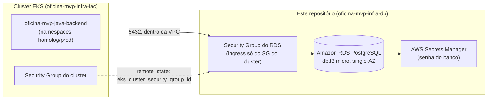

# 🗄️ Oficina MVP — Infraestrutura do Banco de Dados Gerenciado
### Terraform do PostgreSQL via Amazon RDS (repositório 3/4 do Tech Challenge Fase 3 — POSTECH/FIAP)

---

## 📌 1. Propósito

Este repositório provisiona, via Terraform, o **banco de dados gerenciado** (Amazon RDS PostgreSQL) usado pela
aplicação principal do projeto Oficina MVP. É o repositório 3 dos 4 exigidos pelo enunciado do Tech Challenge
Fase 3 — os outros três são:

- [`oficina-auth-function`](https://github.com/lukebria/oficina-auth-function) — Lambda de autenticação por CPF/CNPJ (repositório 1/4).
- [`oficina-mvp-infra-iac`](https://github.com/lukebria/oficina-mvp-infra-iac) — infraestrutura Kubernetes: EKS, ECR, Kong (repositório 2/4).
- [`oficina-mvp-java-backend`](https://github.com/lukebria/oficina-mvp-java-backend) — aplicação principal, Spring Boot, roda no EKS (repositório 4/4).

Antes deste repositório existir, o PostgreSQL rodava como um `Deployment` comum dentro do próprio cluster EKS
(`k8s/banco.yaml`, no repo da aplicação) — sem backup gerenciado, sem alta disponibilidade nativa, e sem
nenhuma linha de Terraform. Este repositório substitui isso por um RDS de verdade.

### Estado atual (2026-10-05)

- ✅ **Validado em ambiente real** (04/10 e 05/10): o RDS PostgreSQL 16 sobe pelo pipeline, a aplicação conecta
  (banco `oficina_mvp`, usuário `oficina`), roda as migrations do Flyway e atende o fluxo completo; o destroy
  pelo pipeline também funciona.
- O ambiente **não fica ligado** (crédito limitado do AWS Academy): é recriado para testes e para a gravação.
  Passo a passo: **runbook do projeto** (`runbook/RUNBOOK.md` no repositório de specs). Depois de cada apply, o
  endpoint e a senha do RDS (que mudam) vão para `DB_HOST`/`DB_PASSWORD` do backend: `node wire-endpoints.js rds`.
- **Chave `DEPLOY_ENABLED`**: com `false` (padrão) os merges só validam; com `true` (ou disparo manual) aplicam
  na AWS. Ver [CI/CD](#️-4-cicd-github-actions).
- No console da AWS: **RDS → Databases → `oficina-mecnica-lab-postgres`** (`Name = oficina-mvp-postgres`) e
  **Secrets Manager → `oficina-mecnica-lab-rds-password`**.

## 🛠️ 2. Tecnologias

- **Terraform** `>= 1.5.0`, provider `hashicorp/aws ~> 5.0` e `hashicorp/random ~> 3.6`.
- **Amazon RDS PostgreSQL** (`db.t3.micro`, engine 16.x) — decisão registrada em
  `plans/00-decisoes-tecnicas.md` do repositório de specs do projeto.
- **AWS Secrets Manager** para a senha do banco (gerada aleatoriamente via `random_password`, nunca versionada
  em texto puro).
- **GitHub Actions** para CI/CD (fmt/validate → plan → apply).
- Backend do state: **S3** (bucket compartilhado com `oficina-mvp-infra-iac`) + lock via **DynamoDB** (tabela
  também compartilhada com aquele repositório).

## 🏗️ 3. Infraestrutura como Código (IaC — Terraform)

### 3.1. Estrutura de arquivos

```text
oficina-mvp-infra-db/
├── modules/
│   └── rds/
│       ├── main.tf              # aws_db_instance, security group, subnet group, senha no Secrets Manager
│       ├── variables.tf         # Variáveis do módulo RDS
│       └── outputs.tf           # Endpoint, porta, nome do banco, ARN do segredo, SG
├── backends.tf                  # Estado remoto no S3 (key própria) + lock DynamoDB compartilhado
├── provider.tf                  # Configuração dos providers (AWS ~> 5.0, random ~> 3.6)
├── data_source_remote_state.tf  # Lê vpc_id/subnet_ids/SG do cluster a partir do state do oficina-mvp-infra-iac
├── main.tf                      # Orquestração do módulo RDS
├── variables.tf                 # Variáveis globais (com defaults)
├── outputs.tf                   # Saídas consolidadas do projeto
├── .github/workflows/
│   ├── create_iac.yml           # Pipeline de fmt/validate → plan → apply
│   └── destroy_iac.yml          # Pipeline manual de destroy
└── README.md                    # Este arquivo
```

### 3.2. O que é provisionado

| Recurso | Módulo | Detalhe |
|---|---|---|
| Instância RDS | `modules/rds` | `aws_db_instance`, engine `postgres` (versão em `var.db_engine_version`), classe `db.t3.micro`, `gp3`, single-AZ, não publicamente acessível |
| Security Group do RDS | `modules/rds` | Libera porta `5432` **somente** a partir do Security Group do cluster EKS (via `terraform_remote_state`) |
| DB Subnet Group | `modules/rds` | Usa as mesmas subnets do cluster EKS (via `terraform_remote_state`) |
| Senha do banco | `modules/rds` | `random_password` + `aws_secretsmanager_secret`/`_version` — nunca em texto puro no state em repouso fora do backend criptografado nem em `.tfvars` |

### 3.3. Ambiente: AWS Academy / Vocareum Learner Lab

Mesmas restrições do repositório `oficina-mvp-infra-iac` (mesma conta de laboratório):

- Credenciais **temporárias** (access key + secret key + **session token**), expiram em poucas horas — precisam
  ser atualizadas manualmente nos GitHub Secrets sempre que a sessão do lab é renovada.
- `skip_final_snapshot = true` e `deletion_protection = false` no RDS existem para facilitar destruir/recriar o
  ambiente durante o desenvolvimento — **não** são configurações recomendadas para produção real.
- **Secrets Manager**: validado no Learner Lab (a `LabRole` cria e lê o segredo). O segredo usa
  `recovery_window_in_days = 0`, para o nome não ficar reservado por 30 dias depois de um destroy.
- **Custo medido** (2026-10): o RDS `db.t3.micro` single-AZ + 20 GB custa ≈ US$ 0,02/h; o ambiente completo dos 4
  repos fica em ≈ US$ 0,26/h. Por isso ele é destruído no fim de cada janela de uso.

### 3.4. State remoto

Backend S3 (`backends.tf`): reaproveita o **mesmo bucket** de state do `oficina-mvp-infra-iac`
(`oficina-mvp-tfstate-536036031274`), com uma **key própria** (`oficina-lab/db/terraform.tfstate`) para não
colidir com o state daquele repositório. Lock via a **mesma tabela DynamoDB** (`oficina-mvp-infra-iac-tf-lock`) — states
diferentes não colidem porque o `LockID` inclui bucket+key.

🔗 **Dependência de ordem**: essa tabela de lock só existe depois que o `oficina-mvp-infra-iac` aplicar seu
`dynamodb.tf` (Fase 1 do bootstrap de lock daquele repositório). Rodar `terraform init` aqui **antes** disso
falha, porque o backend não consegue adquirir lock numa tabela inexistente. Ordem correta: aplicar
`oficina-mvp-infra-iac` primeiro, depois este repositório.

### 3.5. Variáveis

| Variável | Default | Descrição |
|---|---|---|
| `aws_region` | `us-east-1` | Região AWS |
| `project_name` | `oficina-mecnica-lab` | Nome base usado em tags e nomes de recursos |
| `environment` | `lab` | Ambiente, usado só como tag |
| `db_engine_version` | `16` (só a major: a AWS usa a minor default mais recente — minors antigas são retiradas, a 16.4 já não existe) | Versão do PostgreSQL |
| `db_instance_class` | `db.t3.micro` | Classe da instância RDS |
| `db_allocated_storage` | `20` | Armazenamento em GB |
| `db_name` | `oficina_mvp` | Nome do banco de dados inicial |
| `db_username` | `oficina` | Usuário administrador (sensível) |
| `infra_state_bucket` | `oficina-mvp-tfstate-536036031274` | Bucket do state do repo de infra K8s (para o remote state) |
| `infra_state_key` | `oficina-lab/terraform.tfstate` | Key do state do repo de infra K8s |

### 3.6. Outputs

| Output | Descrição |
|---|---|
| `rds_endpoint` | Host do RDS PostgreSQL |
| `rds_port` | Porta do RDS |
| `rds_db_name` | Nome do banco de dados inicial |
| `rds_secret_arn` | ARN do segredo no Secrets Manager com a senha |
| `rds_security_group_id` | Security Group do RDS |

### 3.7. Como rodar localmente

Pré-requisitos: Terraform `>= 1.5.0`, credenciais AWS ativas (AWS Academy Learner Lab: access key + secret key
+ session token), e o repositório `oficina-mvp-infra-iac` já aplicado (para a VPC/subnets/SG do cluster e a
tabela de lock existirem).

```bash
# 1. Exportar credenciais AWS da sessão atual do lab
export AWS_ACCESS_KEY_ID="..."
export AWS_SECRET_ACCESS_KEY="..."
export AWS_SESSION_TOKEN="..."
export AWS_DEFAULT_REGION="us-east-1"

# 2. Inicializar o backend remoto (S3 + lock DynamoDB compartilhado)
terraform init

# 3. Ver o que seria criado
terraform plan

# 4. Aplicar
terraform apply

# 5. Conferir o endpoint gerado
terraform output rds_endpoint
```

Para desfazer: `terraform destroy` (ou disparar manualmente o workflow `destroy_iac.yml`).

### 3.8. Tags dos recursos (o que é cada coisa no console)

Todo recurso AWS criado por este repositório leva as **tags comuns do projeto** (`default_tags` do provider):
`Project=oficina-mvp` (igual nos 3 repos de Terraform), `Repository=oficina-mvp-infra-db`, `Component=banco-de-dados`,
`Environment=lab`, `ManagedBy=terraform`, `Course=FIAP POSTECH 13SOAT - Tech Challenge Fase 3`. Além delas,
cada recurso tem **`Name`** (o que aparece na coluna *Name* do console) e **`Description`**:

| `Name` | Recurso | `Description` |
|---|---|---|
| `oficina-mvp-postgres` | RDS PostgreSQL | Banco PostgreSQL da aplicação |
| `oficina-mvp-rds-sg` | Security Group | Libera o PostgreSQL (5432) somente para o cluster EKS |
| `oficina-mvp-rds-subnets` | DB subnet group | Sub-redes onde o RDS pode rodar |
| `oficina-mvp-rds-password` | Secrets Manager | Senha do banco (gerada pelo Terraform) |

Para ver **todos** os recursos do projeto numa tela só: console AWS → **Resource Groups & Tag Editor → Tag Editor**
→ Region `us-east-1`, Resource types `All supported`, Tag `Project` = `oficina-mvp` → *Search resources*.
Os nomes técnicos (`oficina-mecnica-lab-...`, com o erro de digitação histórico) foram mantidos para não recriar
recursos nem quebrar pipelines; a tag `Name` é o nome legível.

## ⚙️ 4. CI/CD (GitHub Actions)

Dois workflows, exigindo os secrets `AWS_ACCESS_KEY_ID` / `AWS_SECRET_ACCESS_KEY` / `AWS_SESSION_TOKEN` e a
variável `AWS_DEFAULT_REGION` (configurados em 2026-10-04; os 3 secrets AWS expiram a cada sessão do Learner
Lab e precisam ser regravados):

- **`create_iac.yml`** — três jobs em cadeia: `fmt-validate` (com `init -backend=false`, sem credenciais AWS) →
  `plan` → `apply`. Gatilhos de
  `pull_request`/`push` cobrem `homolog` e `master`, seguindo o git flow do projeto (`feat/* → homolog →
  master`); `apply` roda automaticamente em push para qualquer uma das duas.
- **`destroy_iac.yml`** — só dispara manualmente (`workflow_dispatch`).

**Chave de deploy — variable `DEPLOY_ENABLED`** (o crédito do AWS Academy é limitado; detalhe em
`plans/10-chave-deploy-enabled.md` no repositório de specs):
- `true` → em push para `homolog`/`master`, executa automaticamente `plan` e `apply` (deploy automático de homologação e
  produção, como pede o enunciado).
- `false` ou ausente → o pipeline roda só o que não depende da AWS e **pula** (*skipped*) `plan` e `apply`. É o estado
  padrão fora de uma janela de deploy, para um merge não subir recursos pagos.
- **Disparo manual** (*Actions → Run workflow*) ignora a chave: rodar pelo botão já é uma decisão explícita.
- Ligar/desligar: *Settings → Secrets and variables → Actions → Variables → `DEPLOY_ENABLED`*.

Proteção de branch: `master` exige Pull Request (sem commit direto) e bloqueia force-push. Git flow do projeto:
`feat/*` → `homolog` → `master`.

## 🧩 5. Como este repositório se encaixa no projeto

A aplicação principal (`oficina-mvp-java-backend`) usa este RDS como banco: o pipeline dela lê a variable
`DB_HOST` (endpoint do RDS) e o secret `DB_PASSWORD` (senha do Secrets Manager), sem editar YAML. Ordem de
aplicação: `oficina-mvp-infra-iac` **primeiro** (este repo lê o remote state dele: VPC, subnets e security group
do cluster), depois este, depois a aplicação.

O `k8s/banco.yaml` (Postgres em pod) ainda existe no repo da aplicação como **fallback**: só é usado se `DB_HOST`
não estiver configurada. Removê-lo é um passo futuro, sem pressa, já que o ambiente é recriado do zero a cada vez.

Histórico da decisão: `plans/01-infra-db-novo-repo.md` (repositório de specs do projeto).

## 🔄 7. Migração de dados (Postgres em pod → RDS)

Roteiro manual, **só necessário se existir um ambiente com dados no Postgres em pod** que precisem ir para o RDS
(nos testes de 2026-10 o ambiente foi criado do zero, sem migração). Rodar depois que este repositório já tiver
sido aplicado (RDS no ar). Usa o próprio pod do Postgres em cluster para fazer o
`pg_dump`/`pg_restore`, sem precisar expor o RDS publicamente nem instalar nada extra — o pod já está na mesma
VPC/rede que o RDS.

```bash
# 1. Descobrir o namespace e o pod do Postgres em cluster (homolog ou prod)
kubectl get pods -A -l app=banco

# 2. Abrir um shell dentro do pod (troque <namespace> e <pod> pelo que apareceu acima)
kubectl exec -it <pod> -n <namespace> -- sh

# --- a partir daqui, comandos DENTRO do pod ---

# 3. Gerar o dump do banco atual (usa a própria senha do container, já disponível como env var)
PGPASSWORD="$POSTGRES_PASSWORD" pg_dump -h localhost -U oficina -d oficina_mvp -F c -f /tmp/dump.sql

# 4. Restaurar no RDS (pegue o endpoint com `terraform output rds_endpoint` e a senha no Secrets Manager,
#    `aws secretsmanager get-secret-value --secret-id oficina-mecnica-lab-rds-password --query SecretString --output text`)
PGPASSWORD="<senha-do-rds>" pg_restore -h <rds-endpoint> -U oficina -d oficina_mvp -F c --no-owner --no-privileges /tmp/dump.sql

# 5. Sair do pod
exit
```

Depois de confirmar que os dados aparecem certos no RDS (ex: `psql` rápido contando linhas nas tabelas
principais), configurar `DB_HOST`/`DB_PASSWORD` no backend (seção 5) e rodar o pipeline da aplicação.

> Banco/usuário do RDS (`oficina_mvp`/`oficina`) são os mesmos do Postgres em pod e do `application.yml` da
> aplicação — alinhados de propósito, para trocar só `DB_HOST`/`DB_PASSWORD` na migração.

## 🖼️ 6. Diagrama



> Diagrama de arquitetura específico deste repositório. Para a visão consolidada dos 4 repositórios (incluindo
> observabilidade), ver `oficina-mvp-java-backend/docs/architecture.md`, seção 14.
