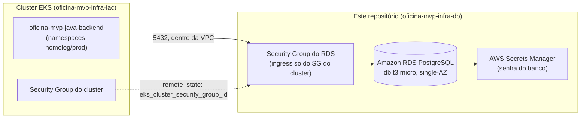

# 🗄️ Oficina MVP — Infraestrutura do Banco de Dados Gerenciado
### Terraform do PostgreSQL via Amazon RDS (repositório 3/4 do Tech Challenge Fase 3 — POSTECH/FIAP)

---

## 📌 1. Propósito

Este repositório provisiona, via Terraform, o **banco de dados gerenciado** (Amazon RDS PostgreSQL) usado pela
aplicação principal do projeto Oficina MVP. É o repositório 3 dos 4 exigidos pelo enunciado do Tech Challenge
Fase 3 — os outros três são:

- [`oficina-auth-function`](https://github.com/lukebria/oficina-auth-function) — Lambda de autenticação por CPF/CNPJ (repositório 1/4).
- [`oficina-mvp-infra-iac`](https://github.com/lukebria/oficina-mvp-infra-iac) — infraestrutura Kubernetes: EKS, ECR, Kong (repositório 2/4).
- [`oficina-mvp-java-backend`](https://github.com/lukebria/oficina-mvp-java-backend) — aplicação principal, Spring Boot, roda no EKS (repositório 4/4).

Antes deste repositório existir, o PostgreSQL rodava como um `Deployment` comum dentro do próprio cluster EKS
(`k8s/banco.yaml`, no repo da aplicação) — sem backup gerenciado, sem alta disponibilidade nativa, e sem
nenhuma linha de Terraform. Este repositório substitui isso por um RDS de verdade.

## 🛠️ 2. Tecnologias

- **Terraform** `>= 1.5.0`, provider `hashicorp/aws ~> 5.0` e `hashicorp/random ~> 3.6`.
- **Amazon RDS PostgreSQL** (`db.t3.micro`, engine 16.x) — decisão registrada em
  `plans/00-decisoes-tecnicas.md` do repositório de specs do projeto.
- **AWS Secrets Manager** para a senha do banco (gerada aleatoriamente via `random_password`, nunca versionada
  em texto puro).
- **GitHub Actions** para CI/CD (fmt/validate → plan → apply).
- Backend do state: **S3** (bucket compartilhado com `oficina-mvp-infra-iac`) + lock via **DynamoDB** (tabela
  também compartilhada com aquele repositório).

## 🏗️ 3. Infraestrutura como Código (IaC — Terraform)

### 3.1. Estrutura de arquivos

```text
oficina-mvp-infra-db/
├── modules/
│   └── rds/
│       ├── main.tf              # aws_db_instance, security group, subnet group, senha no Secrets Manager
│       ├── variables.tf         # Variáveis do módulo RDS
│       └── outputs.tf           # Endpoint, porta, nome do banco, ARN do segredo, SG
├── backends.tf                  # Estado remoto no S3 (key própria) + lock DynamoDB compartilhado
├── provider.tf                  # Configuração dos providers (AWS ~> 5.0, random ~> 3.6)
├── data_source_remote_state.tf  # Lê vpc_id/subnet_ids/SG do cluster a partir do state do oficina-mvp-infra-iac
├── main.tf                      # Orquestração do módulo RDS
├── variables.tf                 # Variáveis globais (com defaults)
├── outputs.tf                   # Saídas consolidadas do projeto
├── .github/workflows/
│   ├── create_iac.yml           # Pipeline de fmt/validate → plan → apply
│   └── destroy_iac.yml          # Pipeline manual de destroy
└── README.md                    # Este arquivo
```

### 3.2. O que é provisionado

| Recurso | Módulo | Detalhe |
|---|---|---|
| Instância RDS | `modules/rds` | `aws_db_instance`, engine `postgres` (versão em `var.db_engine_version`), classe `db.t3.micro`, `gp3`, single-AZ, não publicamente acessível |
| Security Group do RDS | `modules/rds` | Libera porta `5432` **somente** a partir do Security Group do cluster EKS (via `terraform_remote_state`) |
| DB Subnet Group | `modules/rds` | Usa as mesmas subnets do cluster EKS (via `terraform_remote_state`) |
| Senha do banco | `modules/rds` | `random_password` + `aws_secretsmanager_secret`/`_version` — nunca em texto puro no state em repouso fora do backend criptografado nem em `.tfvars` |

### 3.3. Ambiente: AWS Academy / Vocareum Learner Lab

Mesmas restrições do repositório `oficina-mvp-infra-iac` (mesma conta de laboratório):

- Credenciais **temporárias** (access key + secret key + **session token**), expiram em poucas horas — precisam
  ser atualizadas manualmente nos GitHub Secrets sempre que a sessão do lab é renovada.
- `skip_final_snapshot = true` e `deletion_protection = false` no RDS existem para facilitar destruir/recriar o
  ambiente durante o desenvolvimento — **não** são configurações recomendadas para produção real.
- ⚠️ **Ressalva sobre Secrets Manager**: se a `LabRole` da conta não tiver permissão para criar segredos, o
  `apply` falha nos recursos `aws_secretsmanager_secret*` do módulo `rds`. Alternativa nesse caso: trocar por uma
  variável sensível (`TF_VAR_db_password`) injetada via GitHub Secret no pipeline, removendo os recursos de
  Secrets Manager — avaliar na primeira tentativa real de `apply`.
- ⚠️ **Custo do RDS no crédito do lab**: contas AWS Academy Learner Lab não são elegíveis ao Free Tier de 12
  meses das contas normais — o custo do RDS sai do crédito fixo do lab. `db.t3.micro`/single-AZ é a opção mais
  barata avaliada, mas vale acompanhar o consumo de crédito após o primeiro `apply` antes de considerar isso
  100% validado (ver `plans/01-infra-db-novo-repo.md`).

### 3.4. State remoto

Backend S3 (`backends.tf`): reaproveita o **mesmo bucket** do `oficina-mvp-infra-iac`
(`oficina-mvp-infra-iac`), com uma **key própria** (`oficina-lab/db/terraform.tfstate`) para não colidir com o
state daquele repositório. Lock via a **mesma tabela DynamoDB** (`oficina-mvp-infra-iac-tf-lock`) — states
diferentes não colidem porque o `LockID` inclui bucket+key.

🔗 **Dependência de ordem**: essa tabela de lock só existe depois que o `oficina-mvp-infra-iac` aplicar seu
`dynamodb.tf` (Fase 1 do bootstrap de lock daquele repositório). Rodar `terraform init` aqui **antes** disso
falha, porque o backend não consegue adquirir lock numa tabela inexistente. Ordem correta: aplicar
`oficina-mvp-infra-iac` primeiro, depois este repositório.

### 3.5. Variáveis

| Variável | Default | Descrição |
|---|---|---|
| `aws_region` | `us-east-1` | Região AWS |
| `project_name` | `oficina-mecnica-lab` | Nome base usado em tags e nomes de recursos |
| `environment` | `lab` | Ambiente, usado só como tag |
| `db_engine_version` | `16.4` | Versão do PostgreSQL |
| `db_instance_class` | `db.t3.micro` | Classe da instância RDS |
| `db_allocated_storage` | `20` | Armazenamento em GB |
| `db_name` | `oficina` | Nome do banco de dados inicial |
| `db_username` | `oficina_admin` | Usuário administrador (sensível) |
| `infra_state_bucket` | `oficina-mvp-infra-iac` | Bucket do state do repo de infra K8s (para o remote state) |
| `infra_state_key` | `oficina-lab/terraform.tfstate` | Key do state do repo de infra K8s |

### 3.6. Outputs

| Output | Descrição |
|---|---|
| `rds_endpoint` | Host do RDS PostgreSQL |
| `rds_port` | Porta do RDS |
| `rds_db_name` | Nome do banco de dados inicial |
| `rds_secret_arn` | ARN do segredo no Secrets Manager com a senha |
| `rds_security_group_id` | Security Group do RDS |

### 3.7. Como rodar localmente

Pré-requisitos: Terraform `>= 1.5.0`, credenciais AWS ativas (AWS Academy Learner Lab: access key + secret key
+ session token), e o repositório `oficina-mvp-infra-iac` já aplicado (para a VPC/subnets/SG do cluster e a
tabela de lock existirem).

```bash
# 1. Exportar credenciais AWS da sessão atual do lab
export AWS_ACCESS_KEY_ID="..."
export AWS_SECRET_ACCESS_KEY="..."
export AWS_SESSION_TOKEN="..."
export AWS_DEFAULT_REGION="us-east-1"

# 2. Inicializar o backend remoto (S3 + lock DynamoDB compartilhado)
terraform init

# 3. Ver o que seria criado
terraform plan

# 4. Aplicar
terraform apply

# 5. Conferir o endpoint gerado
terraform output rds_endpoint
```

Para desfazer: `terraform destroy` (ou disparar manualmente o workflow `destroy_iac.yml`).

## ⚙️ 4. CI/CD (GitHub Actions)

Dois workflows, exigindo os secrets `AWS_ACCESS_KEY_ID` / `AWS_SECRET_ACCESS_KEY` / `AWS_SESSION_TOKEN` e a
variável `AWS_DEFAULT_REGION` (⚠️ **ainda não configurados neste repositório**):

- **`create_iac.yml`** — três jobs em cadeia: `fmt-validate` → `plan` → `apply`. Gatilhos de
  `pull_request`/`push` cobrem `homolog` e `master`, seguindo o git flow do projeto (`feat/* → homolog →
  master`); `apply` roda automaticamente em push para qualquer uma das duas.
- **`destroy_iac.yml`** — só dispara manualmente (`workflow_dispatch`).

Regras de proteção de branch (PR obrigatório, sem commit direto em `master`) ainda **não configuradas** neste
repositório recém-criado — pendente, ver `plans/01-infra-db-novo-repo.md`.

## 🧩 5. Como este repositório se encaixa no projeto

A aplicação principal (`oficina-mvp-java-backend`) hoje se conecta a um Postgres rodando como `Deployment`
dentro do próprio cluster EKS (`k8s/banco.yaml`). Depois do primeiro `apply` bem-sucedido deste repositório, a
migração prevista é:

1. Remover `k8s/banco.yaml` do repositório da aplicação.
2. Atualizar `k8s/config-secret.yaml`/o pipeline para que `DB_HOST`/`DB_PORT`/`DB_NAME` apontem para os outputs
   deste repositório (`rds_endpoint`, `rds_port`, `rds_db_name`).
3. Migrar dados existentes, se houver algum ambiente rodando com o Postgres em pod (`pg_dump`/`pg_restore`).

Detalhe completo em `plans/01-infra-db-novo-repo.md` (repositório de specs do projeto,
`POST-TECH/FASE-3/plans/`).

## 🖼️ 6. Diagrama



> Diagrama de arquitetura específico deste repositório. Para a visão consolidada dos 4 repositórios (incluindo
> observabilidade), ver `plans/06-documentacao-arquitetural.md` no repositório de specs do projeto.
